# Arcane Assembly

## Game Design Document

Equipo 4: Josué Gómez, Nicolás Matamoros, Luis Felipe Loera

---

## 1. Visión general

**Arcane Assembly** es un roguelite de estrategia táctica centrado en la construcción de tableros hexagonales. En cada combate el jugador no ejecuta ataques manualmente; en cambio, prepara una configuración de piezas arcanas y observa cómo el sistema resuelve automáticamente el enfrentamiento. La experiencia recompensa la planeación, la lectura de sinergias, la adaptación a cada nodo del mapa y la construcción progresiva de una run eficiente

El proyecto está implementado como un juego web con frontend en JavaScript vanilla y un backend en Node.js + Express para autenticación, persistencia de runs y estadísticas

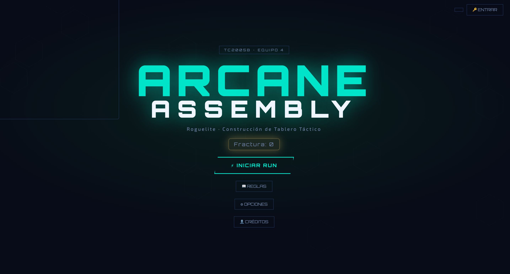

## 2. Premisa y fantasía del jugador

El jugador encarna a un **Ingeniero Arcano** atrapado en el **Pliegue**, una dimensión inestable de energía y estructuras mágicas. Para sobrevivir, debe ensamblar configuraciones de piezas que conviertan energía arcana en daño, defensa y ventajas tácticas. La fantasía principal no es la acción rápida, sino la de ser un diseñador de sistemas: probar combinaciones, optimizar posiciones y construir una máquina de combate

## 3. Pilares de diseño

1. **Estrategia antes que reflejos**  
   El valor principal está en decidir qué piezas llevar, cuáles colocar y cómo acomodarlas

2. **Claridad sistémica**  
   Cada tipo de pieza tiene una función legible y un rol claro en la cadena de resolución

3. **Progresión por run**  
   El mapa, los drafts y los eventos hacen que cada partida evolucione de forma distinta

4. **Satisfacción por sinergia**  
   El momento clave del juego ocurre cuando la configuración del tablero produce resultados mejores a los esperados

## 4. Género y plataforma

- Género principal: Roguelite táctico
- Subgénero: Auto-battler de construcción de tablero
- Plataforma objetivo: Navegador web en escritorio
- Input principal: Mouse o trackpad

## 5. Bucle principal de juego

El flujo jugable actual del proyecto es el siguiente:

1. Pantalla de título
2. Inicio de sesión o registro
3. Inicio de run
4. Generación de mapa de la zona
5. Selección de nodo
6. Armado de mazo de 5 piezas para el combate
7. Colocación de piezas en tablero hexagonal
8. Resolución automática del combate
9. Recompensa por draft, evento o tienda
10. Regreso al mapa
11. Avance a jefe de zona o fin de run

La run completa está planeada para recorrer **3 zonas**

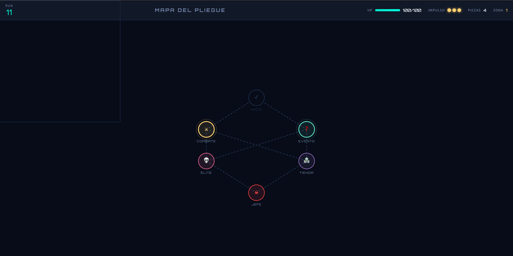

## 6. Core gameplay

### 6.1 Preparación

Antes de cada combate, el jugador selecciona un conjunto de 5 piezas desde su inventario total. Esa selección define las opciones disponibles en el encuentro y funciona como una capa extra de estrategia previa al tablero

### 6.2 Construcción del tablero

Durante el combate, el jugador coloca piezas en un tablero hexagonal de **5x5**. La posición importa porque las piezas interactúan por adyacencia. El jugador puede:

- seleccionar piezas desde el inventario de ronda
- colocarlas en celdas vacías
- levantar y recolocar piezas ya puestas
- limpiar el tablero
- gastar una carga de impulso para obtener una pieza extra

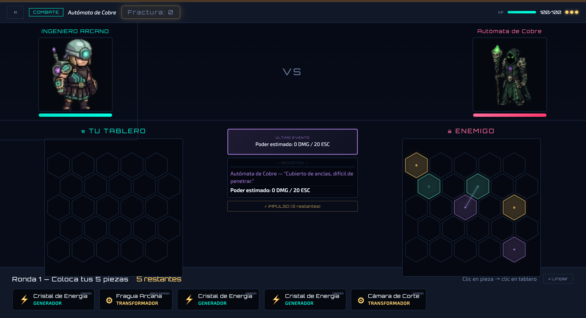

### 6.3 Resolución automática

Cuando el tablero está listo, el combate se resuelve por rondas. El sistema calcula la producción de energía, la conversión en daño, las amplificaciones y los efectos defensivos. El jugador observa el resultado y adapta su siguiente ronda si el enemigo sigue con vida.

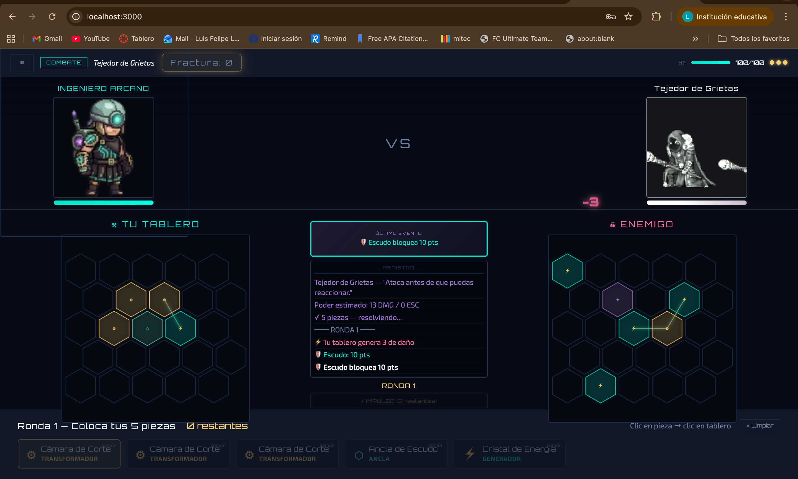

## 7. Tipos de piezas

El catálogo actual del juego se organiza en cuatro familias:

### 7.1 Generadores

Producen la energía base del tablero. Son el punto de partida de casi todas las configuraciones ofensivas

Ejemplos actuales:

- Cristal de Energía
- Núcleo Térmico
- Emisor de Pulso
- Grieta del Vacío

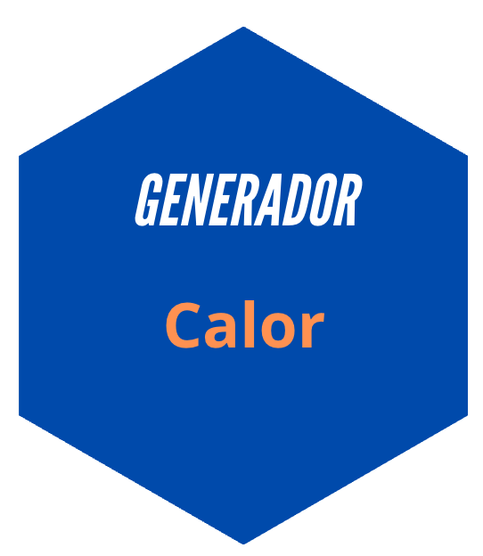

### 7.2 Transformadores

Consumen o aprovechan la energía adyacente para convertirla en daño directo. Son la pieza ofensiva principal de la cadena.

Ejemplos actuales:

- Cámara de Corte
- Fragua Arcana
- Condensador de Tormenta
- Aniquilador

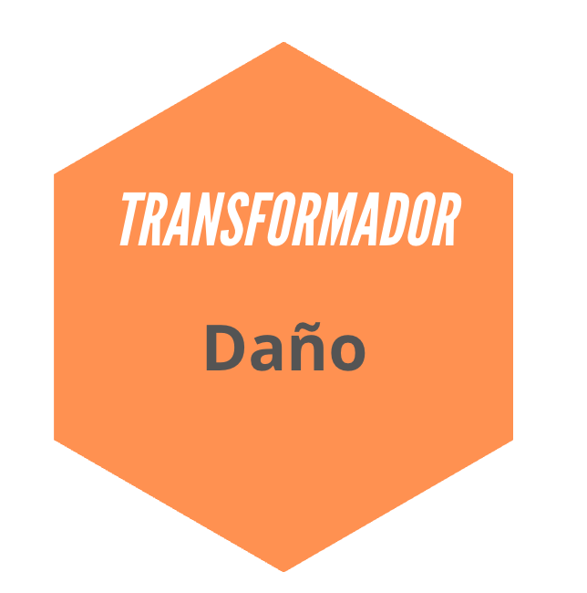

### 7.3 Catalizadores

Amplifican el resultado del tablero. Su función es potenciar el daño total y activar bonos cuando detectan configuraciones correctas a su alrededor.

Ejemplos actuales:

- Resonador
- Prisma Arcano
- Nodo Nexo

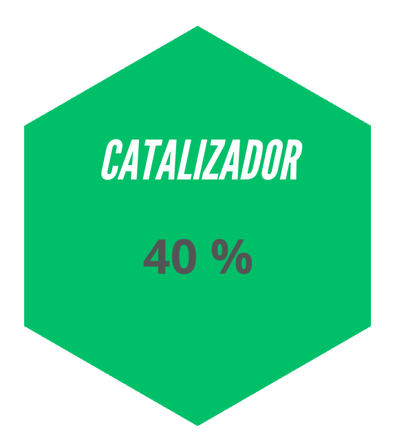

### 7.4 Anclas

Aportan capa defensiva. Según la variante, pueden generar escudo, regeneración o reflejo de daño.

Ejemplos actuales:

- Ancla de Escudo
- Ancla de Regeneración
- Ancla Reflectora
- Ancla Fortaleza

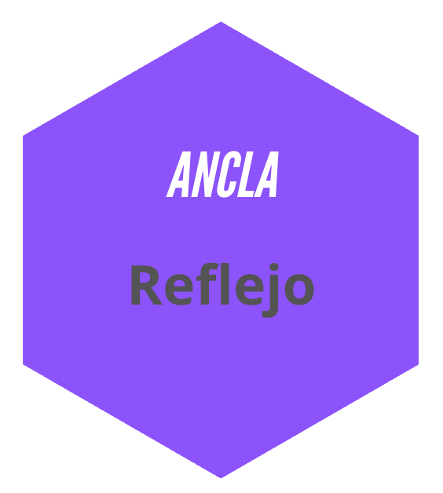

## 8. Sinergias y resolución

La lógica del juego favorece relaciones de vecindad entre piezas. La sinergia más importante del prototipo actual es la interacción entre:

- un **Generador**
- un **Transformador**
- un **Catalizador**

Cuando un Catalizador tiene al mismo tiempo un Generador y un Transformador como vecinos hexagonales, se activa un bono adicional de daño. Esto incentiva al jugador a pensar el tablero como una red y no como piezas aisladas

Orden general de resolución:

1. Generadores producen energía
2. Transformadores convierten esa energía en daño
3. Catalizadores amplifican el resultado
4. Anclas generan defensa y efectos pasivos
5. Se aplican daño, escudo, reflejo y resultado final de la ronda

## 9. Progresión de la run

### 9.1 Mapa por nodos

Cada zona presenta un mapa ramificado con distintos encuentros. El jugador elige su ruta, lo que introduce decisiones de riesgo y recompensa

Tipos de nodo contemplados e implementados en el flujo actual:

- `start`
- `combat`
- `elite`
- `boss`
- `shop`
- `event`

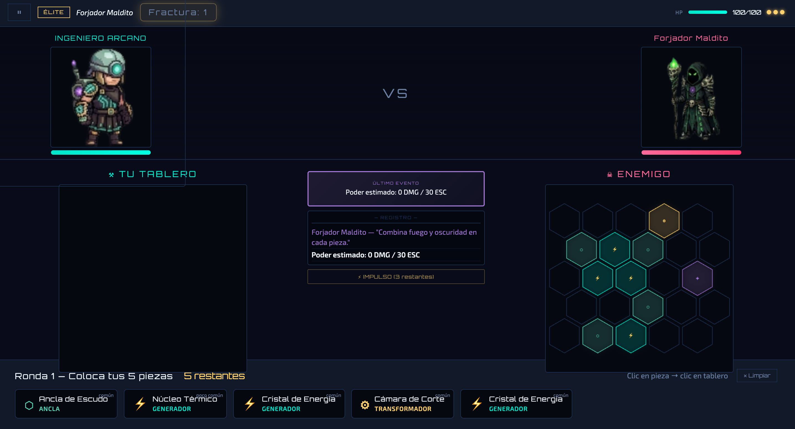

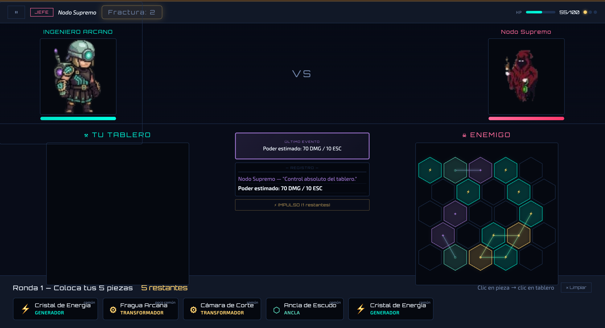

### 9.2 Recompensas

Después de ganar un combate, el jugador entra a un draft donde elige una pieza entre varias opciones. Esa pieza se agrega a la colección de la run y modifica las posibilidades tácticas de encuentros futuros

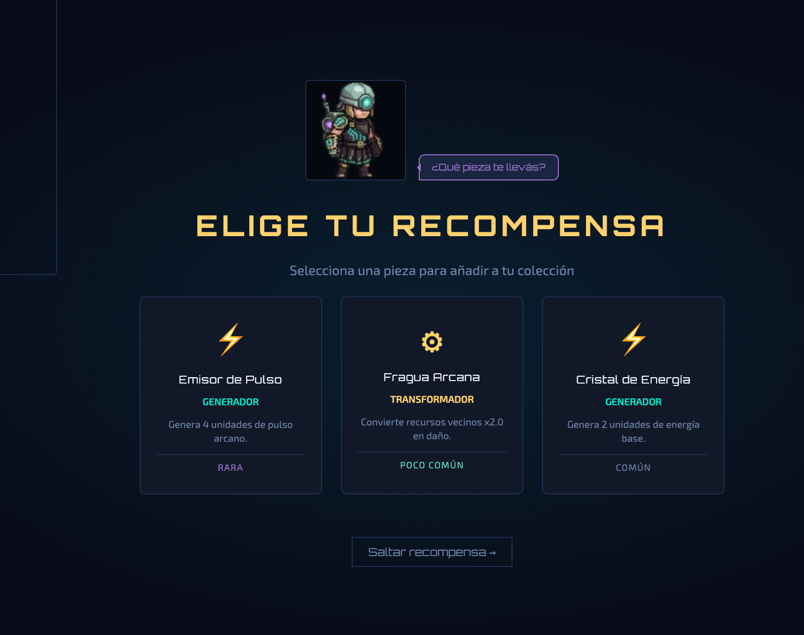

### 9.3 Eventos

Los eventos agregan variación fuera del combate. En el proyecto actual incluyen efectos como:

- curación
- daño inmediato
- obtención de piezas raras
- decisiones neutrales sin efecto

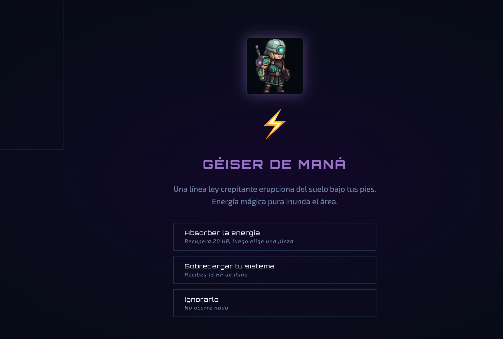

### 9.4 Tienda

La tienda funciona como un nodo de mejora controlada. Su intención es dar acceso a piezas más convenientes o de mejor rareza, con uso limitado por run

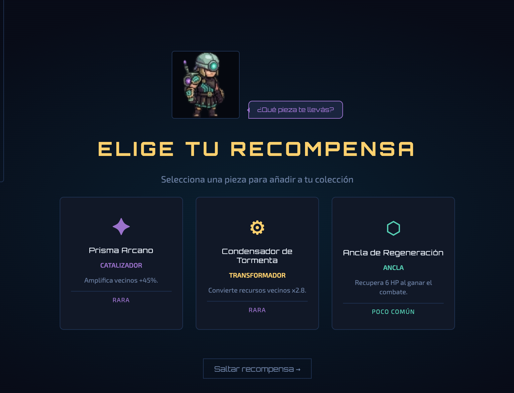

### 9.5 Fractura

La run lleva un valor de **Fractura** que crece con el progreso, especialmente tras victorias y jefes. En términos de diseño, Fractura comunica escalado y presión progresiva conforme avanza la partida

## 10. Condiciones de victoria y derrota

### Victoria

- Derrotar a los jefes de las 3 zonas

### Derrota

- Reducir el HP del jugador a 0 durante una run

## 11. Controles

El juego está diseñado para interacción simple y clara:

- **Click en pieza**: seleccionarla
- **Click en celda vacía**: colocarla
- **Click en pieza ya colocada**: levantarla para moverla
- **Botón Impulso**: obtener una pieza extra en la ronda
- **Botón Limpiar**: reiniciar la colocación del tablero
- **ESC**: pausar o regresar al contexto anterior

## 12. Pantallas del juego

El frontend actual incluye estas pantallas principales:

1. **Título**
2. **Login / Registro**
3. **Mapa**
4. **Deck Builder**
5. **Combate**
6. **Draft**
7. **Evento**
8. **Tienda**
9. **Pausa**
10. **Opciones**
11. **Reglas**
12. **Créditos**
13. **Game Over / Victoria**
14. **Tutorial interactivo**

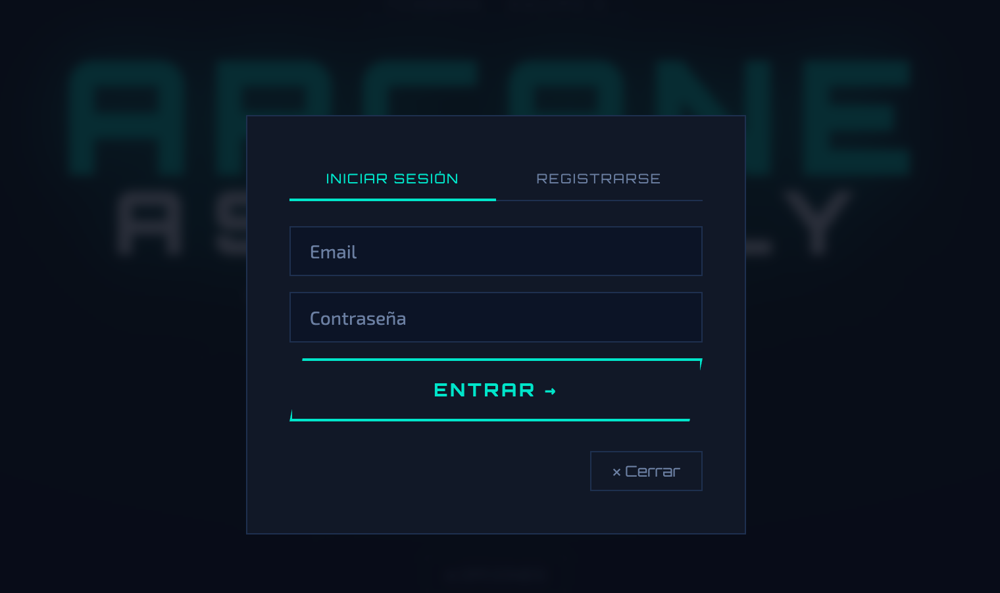

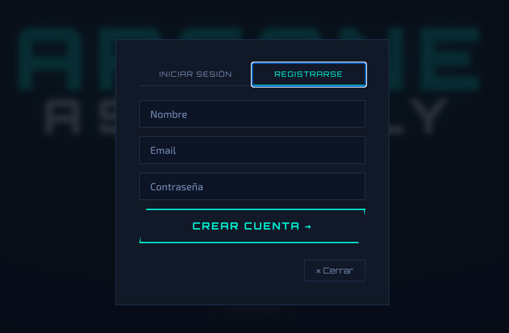

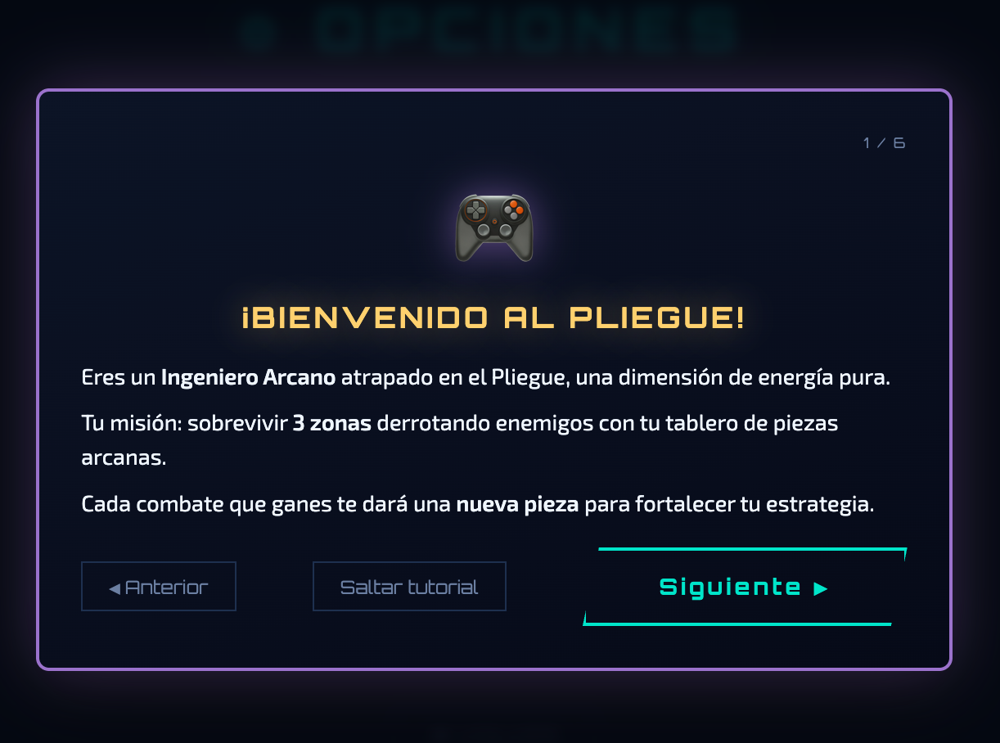

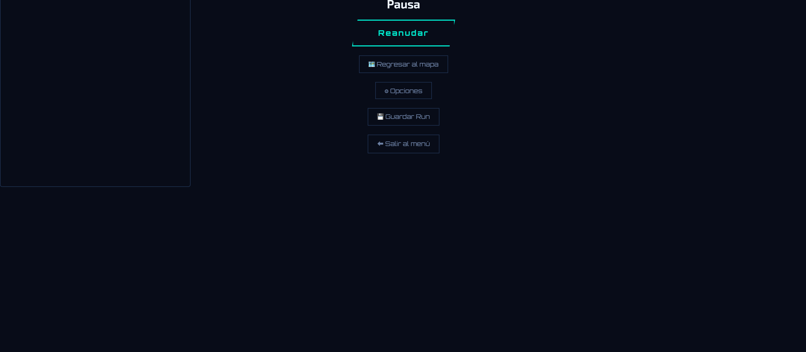

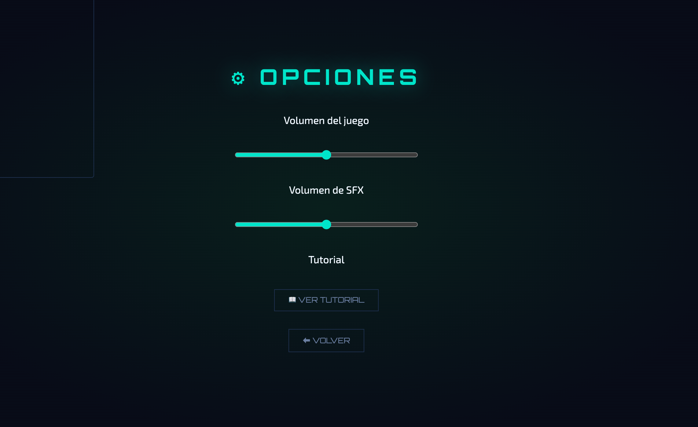

## 13. Diseño visual

### 13.1 Dirección artística

Arcane Assembly usa una estética futurista-fantástica con enfoque funcional. El objetivo visual no es el realismo, sino la legibilidad táctica

### 13.2 Reglas visuales

- Fondo oscuro para resaltar piezas y efectos
- UI con alto contraste
- Tipografía de ciencia ficción
- Uso de íconos y colores por tipo de pieza
- Feedback visual directo para selección, colocación y sinergias
- Sprites animados para jugador y enemigos

### 13.3 Código de color del sistema

El proyecto actual ya comunica tipos mediante colores consistentes:

- Generador: turquesa
- Transformador: dorado
- Catalizador: violeta
- Ancla: verde

Estos colores también se reutilizan en tooltips, etiquetas, HUD y efectos para reforzar lectura rápida

## 14. Audio y feedback

El proyecto contempla sonido como capa de refuerzo para:

- seleccionar piezas
- colocarlas en el tablero
- confirmar acciones
- acompañar daño, defensa y transición entre pantallas

Aunque el valor central del juego es estratégico, el feedback audiovisual es importante para comunicar que una decisión fue aceptada, que una sinergia se activó o que el estado del combate cambió

## 15. Arquitectura del proyecto

### 15.1 Frontend

El cliente web está construido con módulos simples en JavaScript vanilla:

- `constants.js`: catálogo de piezas, enemigos y datos globales
- `board.js`: representación del tablero hexagonal
- `combat.js`: lógica de resolución
- `ui.js`: pantallas y flujo visual
- `game.js`: controlador principal de la run
- `api.js`: conexión con backend
- `tutorial.js`: onboarding del jugador
- `sprites.js` y `fx.js`: animaciones y efectos
- `utils.js`: helpers y estado compartido

### 15.2 Backend

El backend en Express provee:

- autenticación con JWT
- registro e inicio de sesión
- persistencia de runs
- registro de nodos, combates, colocaciones, inventario y eventos
- estadísticas de jugador
- endpoints administrativos

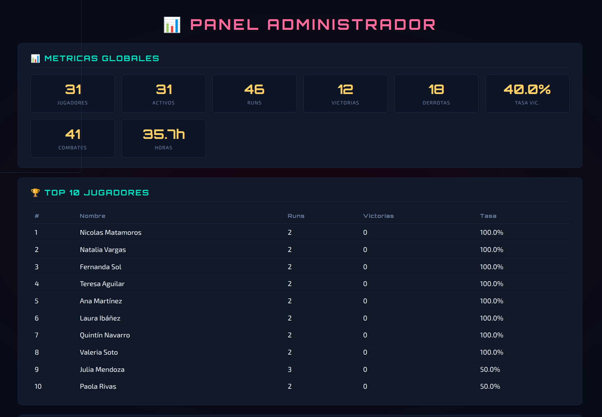

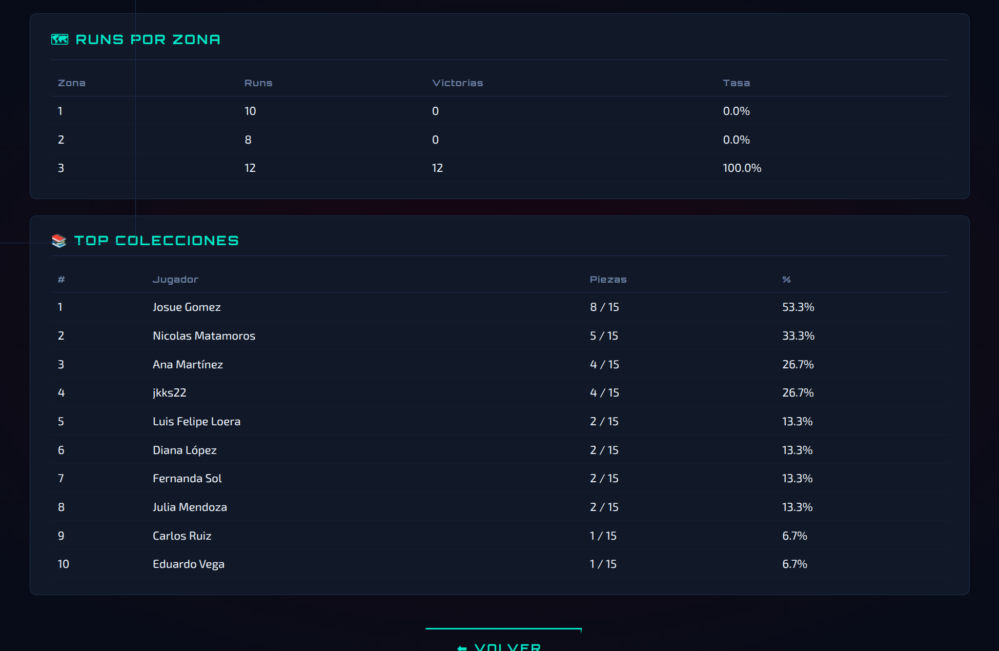

### 15.3 Base de datos

La base de datos MySQL modela entidades como:

- `JUGADOR`
- `RUN`
- `NODO`
- `COMBATE`
- `PIEZA`
- `COLOCACION_TABLERO`
- `INVENTARIO_RUN`
- `EVENTO_NODO`
- `META_JUGADOR_COLECCION`

Esto alinea el diseño del juego con persistencia, historial y métricas

## 16. Alcance actual y coherencia del prototipo

El estado actual del proyecto ya implementa la base jugable principal: mapa, combate, deck builder, draft, eventos, tutorial, autenticación y persistencia. Sin embargo, algunas partes del sistema todavía reflejan una mezcla entre visión final y prototipo académico. Por eso, este GDD describe el juego conforme a lo que el proyecto realmente presenta hoy, sin depender de sistemas no visibles en la build actual

## 17. Propuesta de valor

Arcane Assembly destaca por combinar:

- construcción táctica en tablero hexagonal
- combate automático basado en decisiones previas
- progresión roguelite por mapa
- lectura clara de sinergias
- una fantasía de diseño de sistemas más que de ejecución mecánica

La identidad del proyecto está en hacer que cada combate se sienta como una prueba de diseño estratégico, no como una prueba de reflejos
